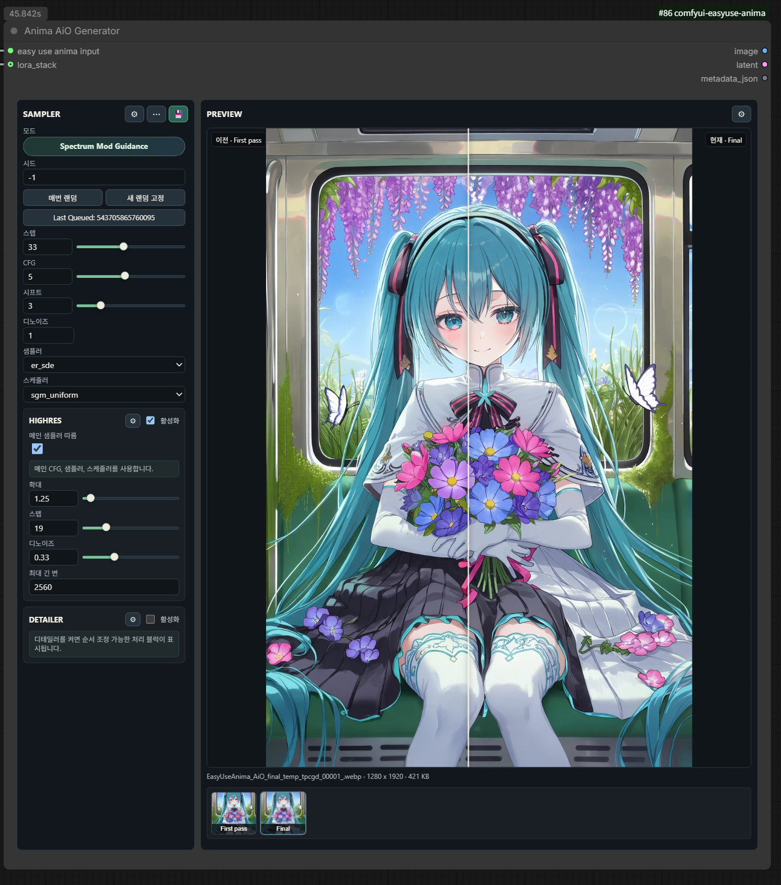
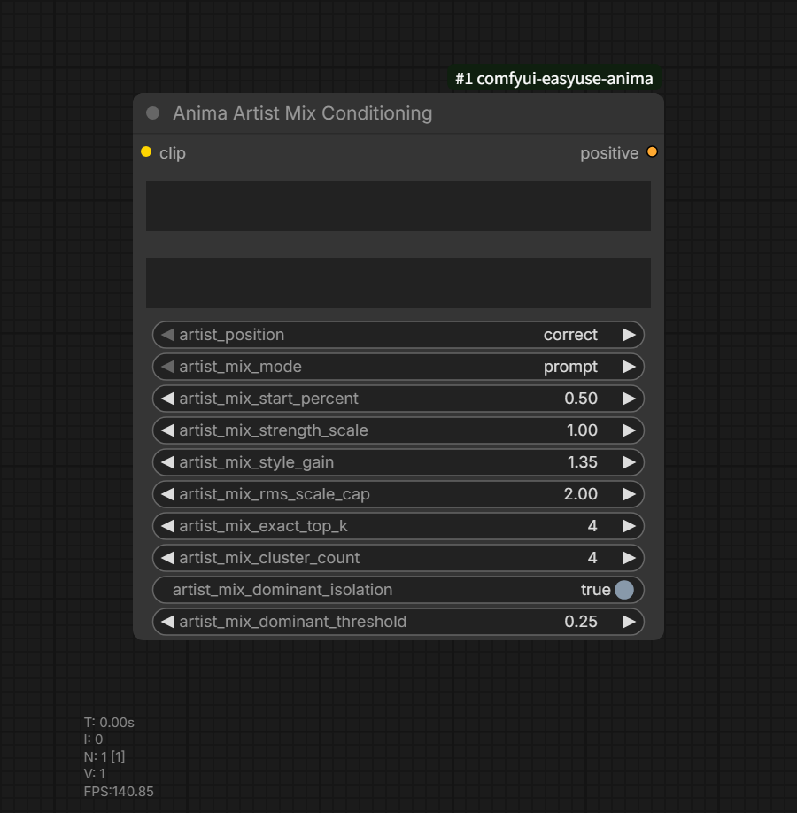

# ComfyUI EasyUse Anima

언어: [English](README.en.md) | [한국어](README.ko.md) | [Home](README.md)

프롬프트 편집, ANIMA 프롬프트 보정, NAIA 프롬프트 연동, LoRA 프리셋 관리,
와일드카드 확장, AiO 생성, ANIMA/Spectrum workflow용 detailer 보조 노드를 제공하는
ComfyUI 커스텀 노드팩입니다.

이 패키지는 `comfyui-naia-bridge`와 독립적으로 동작합니다. 해당 노드팩을
import하거나 덮어쓰지 않으므로, 두 노드팩을 동시에 설치할 수 있습니다.

참고 기준:

- `DNT-LAB/comfyui-naia-bridge` master `b82f98e`
- 사용하는 NAIA API endpoint:
  - `POST /api/comfyui/random`
  - `peng_override` 요청 필드

## 문서 진입점

- 노드별 상세 설명: [노드 문서](docs/nodes/README.ko.md)
- 와일드카드 문법과 예시: [와일드카드 가이드](docs/wildcards.ko.md)
- 자동완성 CSV 선택 기준: [자동완성 CSV 가이드](docs/autocomplete-csv.ko.md)
- 예시 워크플로우: [docs/example_workflows](docs/example_workflows/)
- ANIMA Easy Use workflow v1: [사용 가이드](docs/Anima%20AiO/ANIMA_Easy_Use_workflow_v1_KO.md) / [workflow JSON](docs/example_workflows/ANIMA_Easy_Use_workflow_v1_release_ko.json)
- 버전별 변경 사항: [RELEASE.md](RELEASE.md)

## 빠른 가이드: Anima AiO 생성 흐름



`Anima AiO Generator`는 prompt data context를 받아 1차 샘플링, Highres,
Detailer, 미리보기, 이미지 저장을 한 노드에서 처리합니다. 프롬프트 작성은
`Anima Prompt Studio Advanced v2`와 `Easy Use Anima Input`에서 끝내고, 생성
노드에는 생성 관련 설정만 남기는 구조입니다.

기본 연결:

1. `Anima Prompt Studio Advanced v2`의 `EASYUSE_ANIMA_PROMPT_DATA`를 `Easy Use Anima Input`에 연결합니다.
2. `Easy Use Anima Input`에서 ANIMA diffusion model, VAE, CLIP을 각각 선택합니다.
3. `Easy Use Anima Input` 출력을 `Anima AiO Generator`의 `easy use anima input`에 연결합니다.
4. LoRA를 같이 쓰면 `Anima LoRA Preset`의 `LORA_STACK`을 `lora_stack`에 연결합니다.

기본 노드 화면에서는 seed, steps, CFG, shift, denoise, sampler, scheduler,
Highres, Detailer, Preview, Save만 조작합니다. 모델 패치와 최적화는
`Advanced Options`, 저장 메타데이터는 `Save Options`, 이미지 비교와 피드는
Preview 설정에서 관리합니다. 저장은 기본 ON이며, Image Saver를 사용하면
workflow embed와 Civitai/LoRA metadata 저장까지 한 번에 처리할 수 있습니다.

자세한 설정 기준: [Anima AiO Generator 문서](docs/nodes/anima-aio-generator.ko.md)

배포용 간단 워크플로우:
[ANIMA_Easy_Use_workflow_v1_release_ko.json](docs/example_workflows/ANIMA_Easy_Use_workflow_v1_release_ko.json)
/
[사용법 초안](docs/Anima%20AiO/ANIMA_Easy_Use_workflow_v1_KO.md)

## 빠른 가이드: Artist Mix Conditioning



`Anima Artist Mix Conditioning`은 Prompt Data 없이도 일반 prompt와 별도
`artist_tags` 입력으로 artist mix positive `CONDITIONING`을 만드는 단독
노드입니다. Prompt Studio Advanced v2를 쓰지 않는 간단한 workflow나,
작가 태그 conditioning만 따로 실험할 때 사용합니다.

처음에는 `artist_position=correct`를 유지하고 `artist_mix_mode`는 `prompt`
또는 `average`로 시작하는 것이 안전합니다. 여러 작가의 영향 분리가 필요하면
`hybrid`, 작가 수가 적고 분리도가 더 중요하면 `exact`를 사용합니다. 튜닝
파라미터는 강도를 올리기 전에 branch 비용이 늘어나는 모드인지 먼저 확인하는
것이 좋습니다.

자세한 모드 설명: [Anima Artist Mix Conditioning 문서](docs/nodes/anima-artist-mix-conditioning.ko.md)

## 노드

| 노드 | 카테고리 | 요약 |
| --- | --- | --- |
| [Anima NAIA Random Prompt](docs/nodes/anima-naia-random-prompt.ko.md) | `NAIA Bridge/API` | NAIA remote API에서 prompt, negative prompt, 해상도를 받습니다. |
| [Anima Prompt Corrector](docs/nodes/anima-prompt-corrector.ko.md) | `EasyUse Anima/Prompt` | 쉼표 프롬프트를 ANIMA 순서로 정규화하고 JSON report를 반환합니다. |
| [Anima Prompt Corrector Simple](docs/nodes/anima-prompt-corrector.ko.md#simple-버전) | `EasyUse Anima/Prompt` | 프롬프트 하나를 받아 교정된 프롬프트 하나만 출력합니다. |
| [Anima Prompt Builder](docs/nodes/anima-prompt-builder.ko.md) | `EasyUse Anima/Prompt` | 여러 프롬프트 필드를 조합하고 AMG용 quality 출력을 분리합니다. |
| [Anima Prompt Studio](docs/nodes/anima-prompt-studio.ko.md) | `EasyUse Anima/Prompt` | Prompt Builder에 UI 편집, 자동완성, 하이라이트를 추가합니다. |
| [Anima Prompt Studio Advanced](docs/nodes/anima-prompt-studio-advanced.ko.md) | `EasyUse Anima/Prompt` | positive/negative field, NAIA, 해상도, 와일드카드 제어를 포함합니다. |
| [Anima Prompt Studio Advanced v2](docs/nodes/anima-prompt-studio-advanced.ko.md) | `EasyUse Anima/Prompt` | `EASYUSE_ANIMA_PROMPT_DATA` dict 출력으로 downstream 노드가 key 기반으로 값을 읽게 합니다. |
| [EASYUSE_ANIMA_PROMPT_DATA](docs/nodes/anima-prompt-studio-advanced.ko.md) | `EasyUse Anima/Prompt` | prompt data를 통과시키고 필요한 호환 출력으로 펼칩니다. |
| [Anima Prompt Data Conditioning](docs/nodes/anima-prompt-studio-advanced.ko.md) | `EasyUse Anima/Prompt` | prompt data에서 conditioning, 모델 패치, latent image를 생성합니다. |
| [Anima Artist Mix Conditioning](docs/nodes/anima-artist-mix-conditioning.ko.md) | `EasyUse Anima/Prompt` | 일반 prompt와 별도 artist_tags 입력으로 artist mix positive CONDITIONING을 출력합니다. |
| [Anima Wildcard](docs/nodes/anima-wildcard.ko.md) | `EasyUse Anima/Prompt` | Prompt Studio 없이 와일드카드 문자열만 확장합니다. |
| [Anima LoRA Preset](docs/nodes/anima-lora-preset.ko.md) | `EasyUse Anima/LoRA` | LoRA profile, style prompt, trigger word를 저장하고 출력합니다. |
| [Easy Use Anima Input](docs/nodes/anima-aio-generator.ko.md) | `EasyUse Anima/AiO` | prompt data와 ANIMA diffusion model, VAE, CLIP 선택을 AiO 전용 context로 묶습니다. |
| [Anima AiO Generator](docs/nodes/anima-aio-generator.ko.md) | `EasyUse Anima/AiO` | prompt data context를 받아 샘플링, Highres, Detailer, 미리보기, 저장을 한 노드에서 실행합니다. |
| [Anima Detailer Align Hook](docs/nodes/anima-detailer-align-hook.ko.md) | `EasyUse Anima/Detailer` | Impact detailer crop sampling 크기를 지정 배수로 정렬합니다. |
| [Anima SAM3 Context](docs/nodes/anima-sam3-context.ko.md) | `EasyUse Anima/Detailer` | SAM3 checkpoint를 rgthree-compatible context로 로드합니다. |
| [Anima SAM3 Detailer](docs/nodes/anima-sam3-detailer.ko.md) | `EasyUse Anima/Detailer` | SAM3 text detection, Impact MaskToSEGS, DetailerForEach를 연결합니다. |

## 공통 프론트엔드 기능

자동완성:

- Prompt Builder, Prompt Corrector, Prompt Studio, Prompt Studio Advanced,
  일반 multiline `STRING` prompt/text widget에서 bundled Korean Danbooru
  autocomplete를 사용할 수 있습니다.
- 자동완성 적용 범위는 ComfyUI Settings에서 `off`, `easyuse_nodes`,
  `compatible_global` 중 선택합니다.
- 자동완성과 Prompt Studio 하이라이트에 사용할 CSV는 ComfyUI Settings의
  `EasyUse Anima: Autocomplete CSV`에서 선택할 수 있습니다.
- `__` 또는 `__partial`을 입력하면 와일드카드 자동완성이 열리고,
  `__relative/key__` 형식으로 삽입합니다.
- 자세한 CSV 선택 기준과 포맷은
  [자동완성 CSV 가이드](docs/autocomplete-csv.ko.md)를 참고하세요.

Prompt Studio 하이라이트:

- quality, safety/rating, year, count, character, artist, copyright, metadata,
  learned general tag, natural language, syntax error, unknown tag를 구분해
  표시합니다.
- 와일드카드 문법은 일반 태그와 별도의 색상으로 표시하며, Settings에서 색상을
  변경할 수 있습니다.

ComfyUI Settings:

- NAIA 요청 host, port, Prompt Engineering option, preprocessing option을
  EasyUse Anima settings panel에서 설정합니다.
- EasyUse Anima는 별도 언어 설정을 저장하지 않습니다. 노드 정보, 입력/출력
  힌트, 설정창, 커스텀 DOM 버튼과 툴팁은 ComfyUI 기본 언어 설정을 따릅니다.
- Prompt metadata filter word는 metadata prompt output에만 적용됩니다.
- Prompt Studio 오타 표시와 카테고리/와일드카드 색상을 수동으로 변경할 수
  있습니다.
- Prompt Studio는 NAIA field 위쪽 general field를 자동 토글할 수 있습니다.
- Wildcard extra paths는 항목 추가 방식으로 기존 사용자 와일드카드 폴더를
  등록합니다.
- LoRA Preset row label은 파일명만 표시하거나 전체 경로로 표시할 수 있습니다.

## 요구 사항

NAIA는 `comfyui-naia-bridge`가 사용하는 ComfyUI remote API를 노출해야 합니다.

SAM3 detailer 계열 노드는 실행 시점에 `ComfyUI-Impact-Pack`이 필요합니다. 이것은
Python package dependency가 아니라 ComfyUI custom node dependency이므로
`pyproject.toml`의 Python dependencies에는 넣지 않습니다.

Python dependency 설치:

```bash
pip install -r requirements.txt
```

노드팩 설치 또는 업데이트 후 ComfyUI를 재시작해야 합니다.

## 설치

`ComfyUI/custom_nodes` 아래에 clone합니다.

```bash
git clone https://github.com/n0va39/ComfyUI-EasyUseAnima
```

ComfyUI Python 환경에서 dependency를 설치합니다.

```bash
pip install -r ComfyUI-EasyUseAnima/requirements.txt
```

설치 후 ComfyUI를 재시작합니다.

설정값, LoRA 프리셋 프로필, 기본 와일드카드 폴더는 커스텀 노드 설치 폴더가
아니라 ComfyUI 사용자 데이터 디렉토리에 저장됩니다. 따라서 Manager 업데이트나
git 재설치로 노드팩 폴더가 바뀌어도 사용자 데이터가 유지됩니다.

## ComfyUI Manager / Registry

이 저장소는 향후 Comfy Registry 등록을 위한 `pyproject.toml` metadata를 포함합니다.
Registry node id는 `comfyui-easyuse-anima`입니다.

Registry에 publish하기 전에 `[tool.comfy].PublisherId`가 실제 Comfy Registry
publisher id와 일치하는지 확인해야 합니다.
