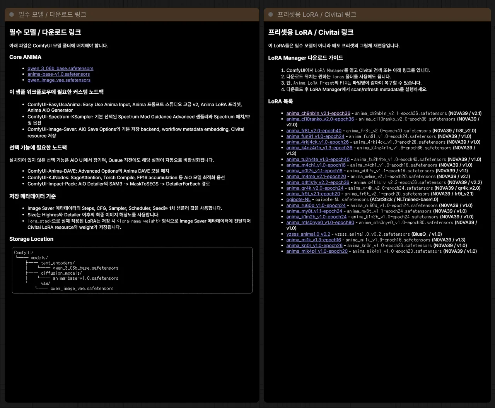
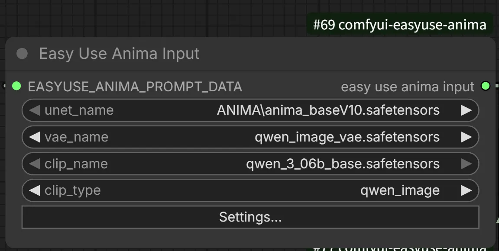
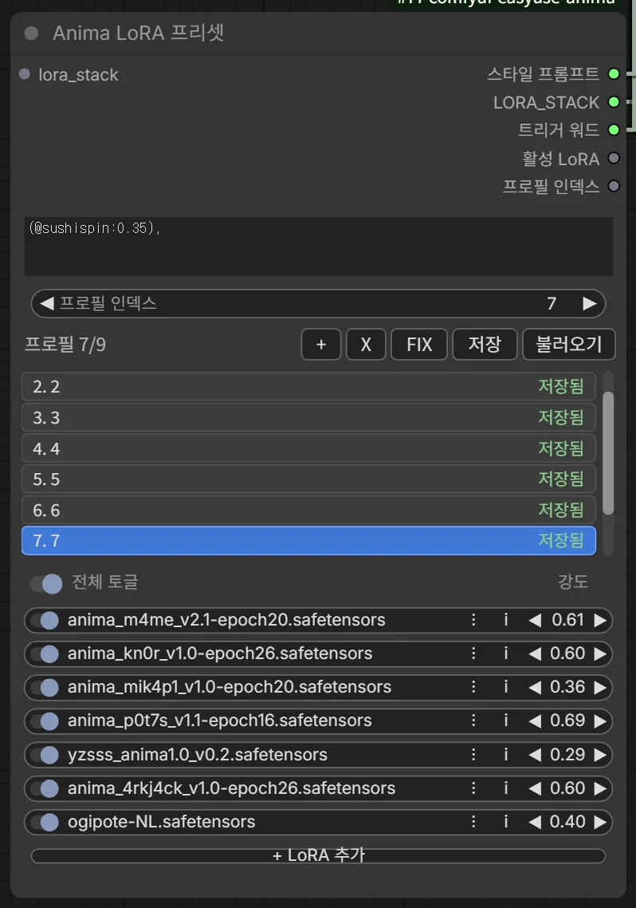
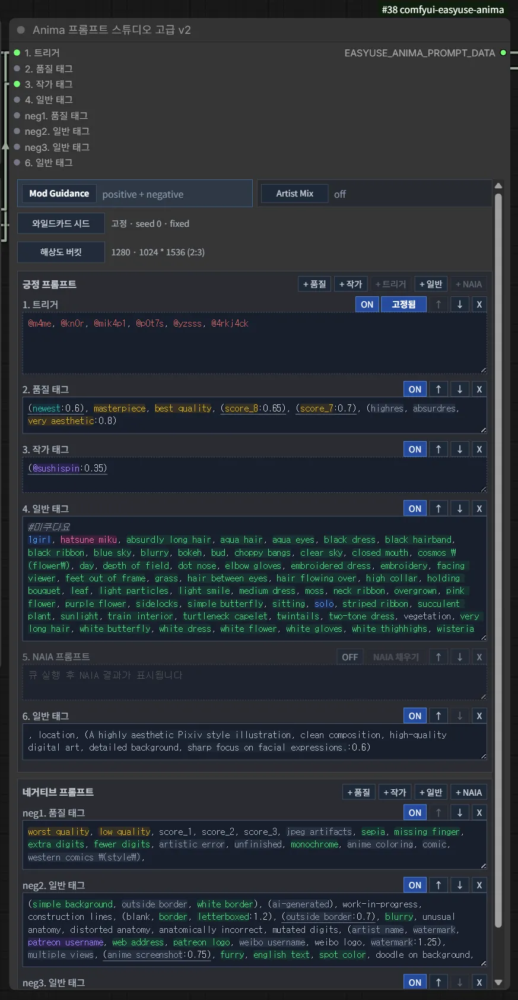
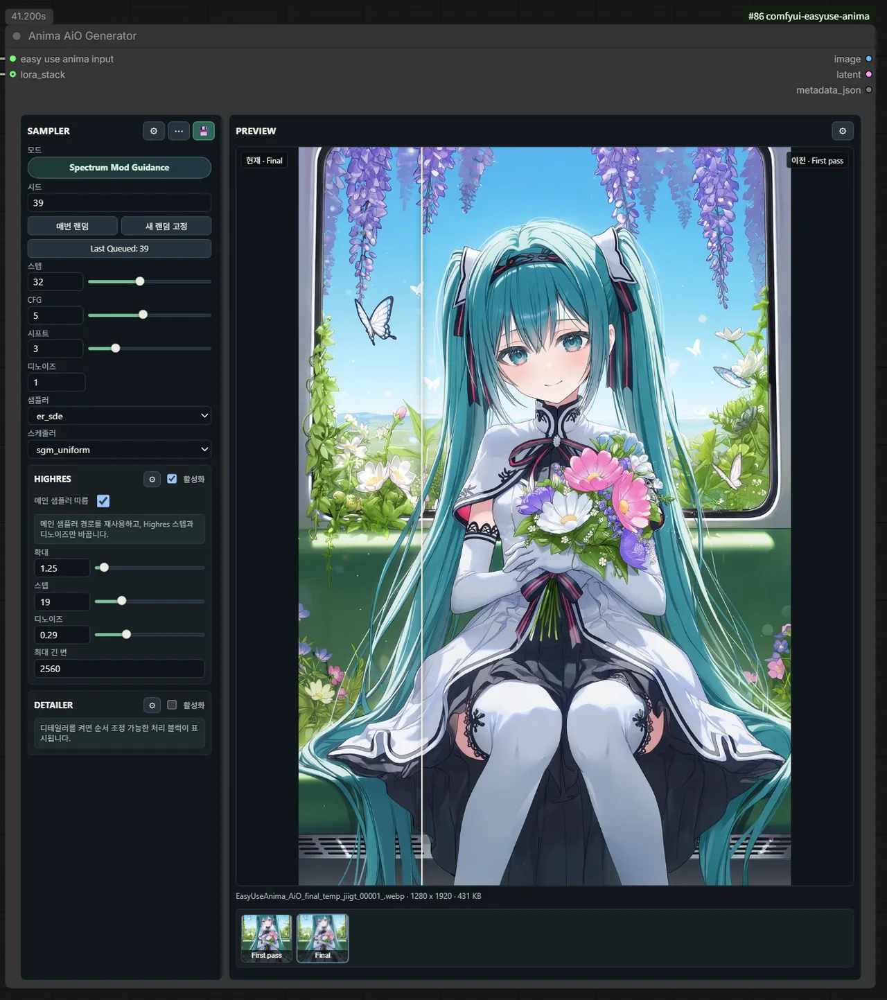
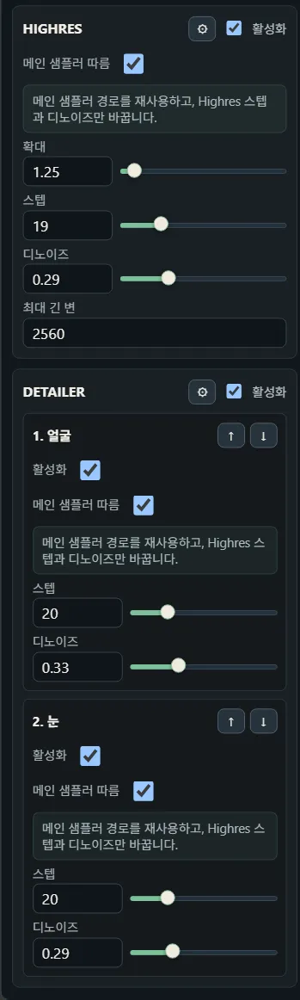

# ANIMA Easy Use workflow v1 User Guide

English workflow:
[ANIMA_Easy_Use_workflow_v1_release_en.json](../example_workflows/ANIMA_Easy_Use_workflow_v1_release_en.json)

Korean workflow:
[ANIMA_Easy_Use_workflow_v1_release_ko.json](../example_workflows/ANIMA_Easy_Use_workflow_v1_release_ko.json)

Korean guide:
[ANIMA_Easy_Use_workflow_v1_KO.md](ANIMA_Easy_Use_workflow_v1_KO.md)

This workflow reduces the ANIMA generation path to four main nodes.
`Anima Prompt Studio Advanced v2` builds the prompt data,
`Anima LoRA Preset` manages the LoRA stack and trigger words,
`Easy Use Anima Input` selects the ANIMA model set, and
`Anima AiO Generator` runs generation, Highres, Detailer, Preview, and Save.

## Quick Start

For the first run, check only the core path.

1. Install the required models and custom nodes.
2. Load the workflow in ComfyUI.
3. In `Easy Use Anima Input`, confirm the diffusion model, VAE, and CLIP.
4. In `Anima LoRA Preset`, disable missing LoRA rows or run `FIX` if matching filenames exist.
5. Enter your main prompt in the `General Tags` field of `Anima Prompt Studio Advanced v2`.
6. Keep Highres and Detailer disabled for the first test run.
7. After base generation works, enable Highres, Detailer, DAVE, and KJNodes optimizations only as needed.

## Required Models

`Easy Use Anima Input` does not load ANIMA as a single checkpoint. Select the
three model files separately.

| Model | Recommended location |
| --- | --- |
| `anima-base-v1.0.safetensors` | `ComfyUI/models/diffusion_models/` |
| `qwen_image_vae.safetensors` | `ComfyUI/models/vae/` |
| `qwen_3_06b_base.safetensors` | `ComfyUI/models/text_encoders/` |

The workflow contains guide notes with model download links. If your filenames
or folders differ, select the files again in `Easy Use Anima Input`.

## Required Custom Nodes

Node packs required for the base generation path:

| Node pack | Why it is needed |
| --- | --- |
| [ComfyUI-EasyUseAnima](https://github.com/n0va39/ComfyUI-EasyUseAnima) | Prompt Studio Advanced v2, LoRA Preset, Easy Use Anima Input, AiO Generator |
| [ComfyUI-Spectrum-KSampler](https://github.com/sorryhyun/ComfyUI-Spectrum-KSampler) | Default sampler backend and Spectrum optimization |

Strongly recommended or optional node packs:

| Node pack | Used for |
| --- | --- |
| [ComfyUI-Lora-Manager](https://github.com/willmiao/ComfyUI-Lora-Manager) | LoRA trigger-word and metadata management |
| [ComfyUI-KJNodes](https://github.com/kijai/ComfyUI-KJNodes) | SageAttention, Torch Compile, FP16 accumulation |
| [ComfyUI-Impact-Pack](https://github.com/ltdrdata/ComfyUI-Impact-Pack) | SAM3, MaskToSEGS, DetailerForEach based Detailer |
| [ComfyUI-Anima-DAVE](https://github.com/sorryhyun/ComfyUI-Anima-DAVE) | Optional model patch for generation diversity |

This workflow expects a `ComfyUI-EasyUseAnima` release that includes EasyUse
native output. If an optional node pack is missing, the related UI is locked or
disabled before queueing.

## LoRA Preset

`Anima LoRA Preset` stores style prompts and LoRA stacks as profiles. The LoRAs
included in the sample workflow are not required core models. They are only for
reproducing the bundled sample styles.

Main behavior:

- Select a saved LoRA combination with `Profile Index`.
- Toggle each row and adjust strength per LoRA.
- The `LORA_STACK` output connects to `lora_stack` on `Anima AiO Generator`.
- The `Trigger Words` output connects to the trigger field in Prompt Studio.
- If LoRA paths changed, `FIX` can recover rows when the filename still matches.
- Use LoRA Manager scan/refresh to keep trigger words and metadata available.

## Prompt Input

Edit prompts in `Anima Prompt Studio Advanced v2`. The node outputs
`EASYUSE_ANIMA_PROMPT_DATA`, and downstream nodes read prompt values by key
instead of depending on positional string outputs.

Default field roles:

| Field | Role |
| --- | --- |
| `Trigger Words` | Overridden at execution time when connected from LoRA Preset. |
| `Quality Tags` | Score, quality, highres, and similar quality tags. |
| `Artist Tags` | Artist tags or tags used for artist mix conditioning. |
| `General Tags` | Main subject and general prompt area. This is the field you edit most often. |
| `NAIA Prompt` | Optional field for imported NAIA prompts. Keep it disabled if unused. |
| `negative fields` | Separate quality negative tags from general negative tags. |

Wildcards and autocomplete are available in this editor. See the
[Wildcard Guide](../wildcards.en.md) for wildcard syntax and the
[Prompt Studio Advanced guide](../nodes/anima-prompt-studio-advanced.en.md) for
Prompt Studio details.

## Generation

`Anima AiO Generator` is the output node that executes generation. The left side
contains sampler, Highres, and Detailer settings. The center area shows the
current image and optional comparison with previous stages.

The default sampler backend is `Spectrum Mod Guidance`. Initial values:

| Setting | Default |
| --- | --- |
| Steps | `32` |
| Sampler | `er_sde` |
| Scheduler | `sgm_uniform` |
| AuraFlow shift | `3` |
| Denoise | `1` |

Open sampler details with the gear button in the sampler section. This workflow
supports `comfy_ksampler`, `spectrum_mod_guidance_advanced`, and
`spectrum_spd_speed`. If you are not sure which path to use, keep the default
`Spectrum Mod Guidance` backend.

For Spectrum speed tuning, start with `Flex window` and `Warmup steps`. Raise
`Flex window` gradually for more speed, and raise `Warmup steps` if quality
drops too much. For the full sampler option reference, use the
[ComfyUI-Spectrum-KSampler](https://github.com/sorryhyun/ComfyUI-Spectrum-KSampler)
documentation.

## Highres And Detailer

Start with Highres and Detailer disabled. Enable them only after base generation
works in your environment.

Highres:

- With `Follow main sampler` enabled, backend, CFG, sampler, and scheduler are
  inherited from the first-pass sampler. Highres still uses its own steps and denoise.
- If the first pass uses the SPD path, Highres falls back to `comfy_ksampler`.
- Spectrum, DCW, CFG++, FSG, and SMC correction/forecast options can be enabled
  and tuned separately in Highres details.
- Size is adjusted through the `Anima Image Scale By Multiple` path so the
  result follows the requested scale and valid multiples.
- Defaults are `Scale by=1.25`, `Steps=19`, `Denoise=0.29`, `Max long edge=2560`.

Detailer:

- Enable or disable blocks such as Face and Eye Detailer.
- Add detailer blocks in the details panel, then tune each block's detection
  prompt, steps, denoise, and sampler patch options separately.
- Change block execution order with the up/down buttons.
- Detection uses SAM3 and the Impact Pack MaskToSEGS/DetailerForEach path.
- Mod Guidance follows the common AiO Generator setting.
- Spectrum, DCW, CFG++, FSG, and SMC correction/forecast options can be enabled
  and tuned per detailer block.
- Crop sizes are aligned to safe 32-multiple dimensions through the
  `Anima Detailer Align Hook` logic.

## Preview And Saving

Preview settings can show intermediate images, compare stages, and update the
image feed. These settings affect only the node UI. They do not change saved
image metadata.

Save Options are enabled by default. The default backend is EasyUse native
output, which handles PNG/JPEG/WebP, embedded workflows/JSON sidecars,
A1111 metadata, and Civitai-compatible hashes without `ComfyUI-Image-Saver`.
Turn off `Lossless WebP` to use lossy WebP controlled by `JPEG/WebP quality`.
Remote `Civitai data` enrichment is off by default; enable it explicitly when
you want fixed-host Civitai API lookups. Local model and LoRA hashes do not
require this option.

Saved metadata uses:

- `Steps`, `CFG`, `Sampler`, `Scheduler`, `Seed`, `Denoise`: first-pass sampler values
- `Size`: final resolution after Highres and Detailer
- `lora_stack`: records each applied file's SHA-256 short hash and weight

Keep `Embed workflow` enabled if you want saved images to reload back into the
same workflow setup.

## Troubleshooting

- If sampler or scheduler queue validation reports `Value not in list`, check
  your installed `ComfyUI-Spectrum-KSampler` version and the sampler list in ComfyUI.
- If native saving fails, check the output-relative path, filename template,
  and image format in Save Options. Civitai lookup failures are warnings; local
  hashes and image saving continue.
- If a LoRA file is missing, disable that row or run `FIX`.
- If an optional node pack is missing, disable the related feature or install
  the node pack and restart ComfyUI.
- If the full workflow fails with Highres and Detailer enabled, run the base
  generation path first, then enable optional stages one at a time.
