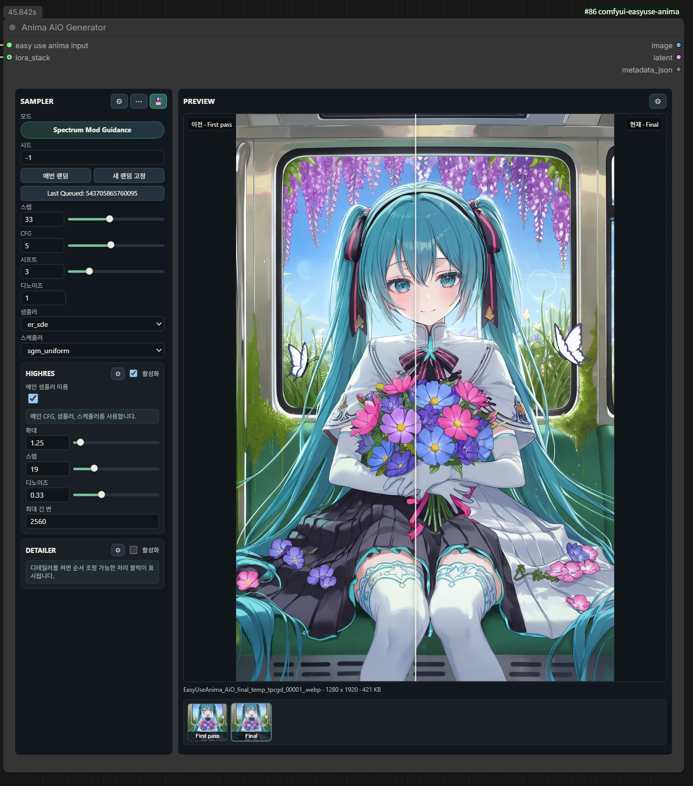

# Anima AiO Generator

Category: `EasyUse Anima/AiO`

`Anima AiO Generator` consumes the dedicated context from `Easy Use Anima Input`
and runs prompt encoding, first-pass sampling, optional Highres, optional
Detailer, and image saving in one output node. Prompt editing stays upstream in
Prompt Studio, so the generator UI does not expose prompt fields.

## Basic Wiring

1. Connect prompt data from `Anima Prompt Studio Advanced v2` to `Easy Use Anima Input`.
2. In `Easy Use Anima Input`, select the ANIMA diffusion model, VAE, and CLIP separately.
3. Connect `Easy Use Anima Input` to the generator's `easy use anima input` socket.
4. Optionally connect `LORA_STACK` from `Anima LoRA Preset` to `lora_stack`.
5. Only for a third-party AiO extension, connect its `EASYUSE_ANIMA_AIO_HOOK`
   output to `aio_hook`. Compose multiple hooks with `Anima AiO Hook Combine`.

## Extension hooks

`aio_hook` is optional; leaving it disconnected preserves existing generation
and save behavior. Version 1 exposes only final postprocess before/after
callbacks, same-shape `IMAGE` patches, extension metadata, and optional previews.
A hook-modified `IMAGE` is not re-encoded to make the Generator's `LATENT`
output match it.

To build a hook node, see the [AiO Hook API v1 developer guide](../extensions/aio-hooks.en.md)
and the [copyable example](../../examples/third_party_aio_hook/).

## Generation Profiles

The profile button in the `SAMPLER` header applies one complete generation
settings snapshot.

- `Normal` keeps the standard defaults and disables optional Spectrum/DCW and
  KJ execution optimizations.
- `Turbo` uses `steps=10`, `CFG=1`, `er_sde`, and `simple`.
- `Optimized` enables Spectrum/DCW across sampling stages plus the recommended
  KJ FP16 accumulation, SageAttention, Sage compile, and Torch Compile values.
  DAVE and Safe PAG remain separate choices and stay disabled.

If the current settings do not exactly match a built-in profile, the button
shows `Custom`. A named user profile stores the complete current settings in
ComfyUI user data and can be loaded, overwritten, renamed, or deleted after a
restart. Editing an applied user profile changes the label back to `Custom`.

Workflows serialize the complete generation settings, not the selected profile
name. This preserves the generated setup even when the named profile is not
available on another ComfyUI installation.

## Sampler Modes

The `Mode` field in Sampler settings selects the actual execution path.

Initial defaults are `steps=32`, `sampler=er_sde`, `scheduler=simple`, and
`shift=3.0`. `shift=3.0` is the Anima model-recommended default and is always
applied.

| Mode | Call path | Required node pack |
| --- | --- | --- |
| `comfy_ksampler` | ComfyUI built-in KSampler. Optional Spectrum model patches and corrections can be applied before sampling | Built-in ComfyUI, optional `ComfyUI-Spectrum-KSampler` |
| `spectrum_mod_guidance_advanced` | Direct call to `KSampler (Spectrum + Mod Guidance Advanced)` | `ComfyUI-Spectrum-KSampler` |
| `spectrum_spd_speed` | Direct call to `KSampler (Spectrum + SPD / SPEED)` | `ComfyUI-Spectrum-KSampler` |

Integrated Spectrum sampler modes do not also call the model-patch path meant for
the normal KSampler. Highres reuses the first-pass sampler path by default, but
overrides only `Steps` and `Denoise` with the Highres values. When the first pass
uses `spectrum_spd_speed`, Highres does not reuse SPD/SPEED and falls back to the
general KSampler path. When main-sampler reuse is disabled, Highres always uses
the general KSampler path.

Calls to `SpectrumKSamplerAdvanced` and `SpectrumSPDKSampler` are filtered
against the installed Spectrum node pack's actual `sample()` signature so
unsupported parameters are not passed. Sampler Details also reads `/object_info`
to show discovered extra inputs under `Detected inputs` and uses node-pack
tooltips when they are available.

`Anima DAVE`, AuraFlow shift, KJNodes FP16 accumulation, SageAttention, and
Torch Compile are not sampler modes. They are model patch/optimization controls
in Advanced Options and are applied before the selected first-pass sampler when
enabled.

Highres defaults are `Scale by=1.5` and `Denoise=0.25`. Highres and Detailer settings use a
single-column scroll layout so long option sets remain readable.

Detailer Settings show Face/Eye processing blocks as tabs. Each tab can be
renamed and moved left or right to change execution order. Tab names are UI
metadata; runtime dispatch uses stable internal keys plus `detailer.order`.

## Saving And Reproducibility

Save Options are enabled by default and use the `ComfyUI-Image-Saver` backend.
Keep `Embed workflow` enabled when saved images should reload into the same
generation setup. Civitai Hash Fetcher rows store username, model name, and
version, then pass `model_name:AutoV3` into Image Saver `additional_hashes`.

Saved metadata uses first-pass sampler values for `Steps`, `CFG`, `Sampler`,
`Scheduler`, `Seed`, and `Denoise`. `Size` uses the final image resolution after
Highres and Detailer. LoRAs applied through `lora_stack` are appended to the
Image Saver metadata prompt as `<lora:name:weight>` tokens so Image Saver can
write Civitai LoRA resources and weights.

## Required Node Packs

- Required: `ComfyUI-EasyUseAnima`
- Sample workflow defaults: `ComfyUI-Spectrum-KSampler`, `ComfyUI-Image-Saver`
- Optional features: `ComfyUI-KJNodes` for SageAttention/Torch Compile, `ComfyUI-Impact-Pack` for the AiO SAM3 detailer path, `ComfyUI-Anima-DAVE` for the Anima DAVE model patch

When an optional node pack is not installed, the related UI is locked and queue
preparation disables that option before execution.

Example workflows:

- [ANIMA_Easy_Use_workflow_v1_release_en.json](../example_workflows/ANIMA_Easy_Use_workflow_v1_release_en.json)
- [ANIMA_Easy_Use_workflow_v1_release_ko.json](../example_workflows/ANIMA_Easy_Use_workflow_v1_release_ko.json)
- [EasyUse_Anima_AiO_generator_release_ko.json](../example_workflows/EasyUse_Anima_AiO_generator_release_ko.json)

Usage guide: [ANIMA Easy Use workflow v1](../Anima%20AiO/ANIMA_Easy_Use_workflow_v1_EN.md)
