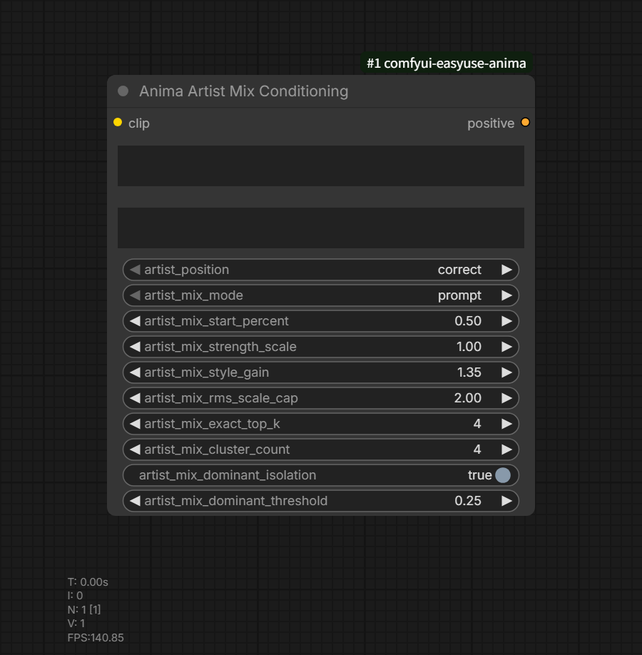
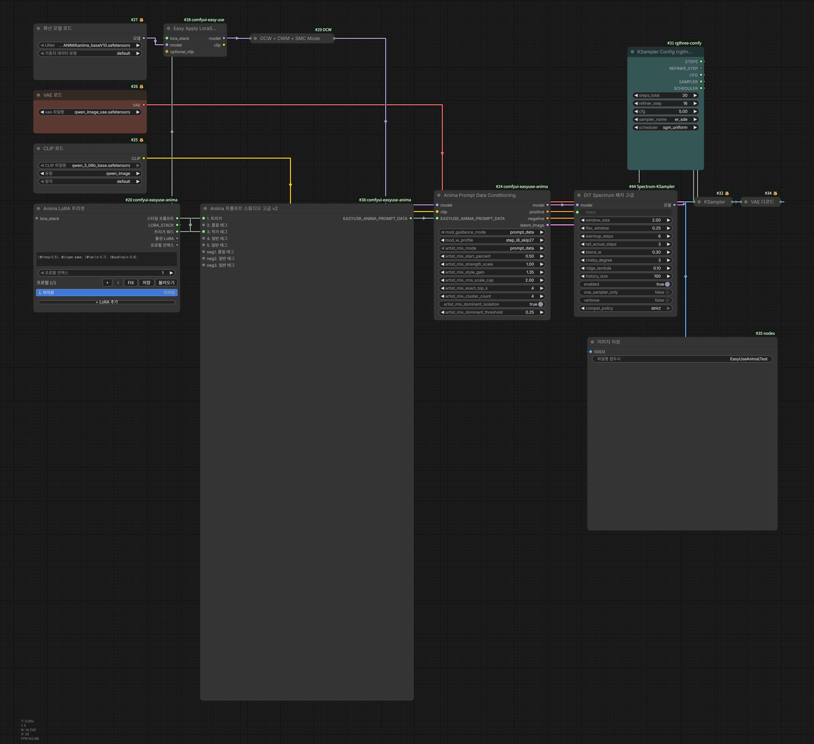

# Anima Artist Mix Conditioning

Category: `EasyUse Anima/Prompt`



Inputs:

- `clip`
- `prompt`
- `artist_tags`
- `artist_position`
- `artist_mix_mode`
- artist mix tuning inputs

Output:

- `positive`

This standalone artist mix node takes a regular positive prompt plus separate
artist tags and outputs positive `CONDITIONING`. Use it when a workflow does
not use Prompt Studio Advanced v2 but still needs the same artist mix methods.

Artist tags here means the text entered in the `artist_tags` input, not tokens
marked with `@`.

## Artist Group Syntax

To keep multiple artists in one artist mix branch, write them like this in
`artist_tags`.

```text
[[artist_a, artist_b:0.7]], artist_c
```

- `[[artist_a, artist_b:0.7]]` encodes the two artists as one branch.
- The final `:0.7` before `]]` is a conditioning mix weight, not a
  prompt-string weight.
- If an individual prompt weight is needed inside the group, use normal prompt
  weight syntax such as `(artist_a:0.35)`. The Artist Mix group weight is only
  the final top-level `:weight` before `]]`.
- In `prompt` mode, group markers and group weights are removed and the prompt
  is encoded as normal text, for example `artist_a, artist_b, artist_c`.
- `{a|b|c}` remains wildcard dynamic prompt syntax and is not used for artist
  mix grouping.

## Position Handling

`artist_position` controls where artist tags are applied.

| Value | Behavior |
| --- | --- |
| `correct` | Default. Combines `prompt` and `artist_tags`, then applies ANIMA prompt ordering. |
| `front` | Pins artist tags before the prompt. |
| `back` | Pins artist tags after the prompt. |

Use `correct` for normal ANIMA syntax. Use `front` or `back` only when another
conditioning workflow requires a fixed artist-tag position.

## Artist Mix Mode

Artist mix controls whether artist tags are simply inserted into one prompt or
encoded as separate CLIP conditionings before being mixed. The cost column uses
the number of positive conditioning branches. More branches keep artist effects
more separated, but they also give the sampler more conditioning work.

Start with `prompt` or `average`. Use `hybrid` when a few artists should stay
distinct but full `exact` is too expensive. Use `exact` only when the artist
count is small or faithful per-artist separation matters more than cost.

| Value | Cost | When To Use |
| --- | --- | --- |
| `prompt` | 1 positive branch | Inserts artist tags into the prompt and encodes once. This is closest to normal prompt writing and is a useful baseline. |
| `average` | 1 positive branch | Encodes each artist and blends the conditionings. Use it when you want clearer artist-field weighting without increasing branch count. |
| `delta_rms` | 1 positive branch | Treats the difference between the base prompt and artist prompts as a compressed style delta. Try it when `average` feels too weak. |
| `hybrid` | top K + 1 branches | Keeps the strongest artists as exact branches and compresses the remaining tail. This is the practical middle ground when `exact` is too heavy. |
| `clustered` | cluster_count branches | Groups similar artist deltas into several compressed branches. Use it for many artists when `average` is too blended and `exact` is too expensive. |
| `exact` | N artist branches | Creates one conditioning branch per artist. It is the most direct and separated mode, but cost grows with the artist count. |

Compatibility modes:

- `composite_exact`: uses exact branches plus a full artist-prompt branch.
- `late_exact`: starts from the base prompt, then adds exact branches after the selected sampling percent.
- `average_late_exact`: behaves closer to average early and closer to exact late.
- `scheduled_average`: applies averaged artist conditioning over a sampling range.

These compatibility modes are shared with Prompt Data Conditioning. For most
workflows, choose among `prompt`, `average`, `hybrid`, and `exact` first.

## Example Workflow



- Workflow JSON: [EasyUse_Anima_artist_mix_release_ko.json](../example_workflows/EasyUse_Anima_artist_mix_release_ko.json)
- Preview PNG: [EasyUse_Anima_artist_mix_release_ko.png](../example_workflows/EasyUse_Anima_artist_mix_release_ko.png)

This example sends the artist field from `Anima Prompt Studio Advanced v2`
through `EASYUSE_ANIMA_PROMPT_DATA`, then applies `artist_mix_mode` `exact` in
`Anima Prompt Data Conditioning`. The sample artist strings include `@`-prefixed
items, but artist mix identifies artist tags by the artist field or
`artist_tags` input, not by the `@` prefix.

## Tuning Inputs

- `artist_mix_start_percent`: sampling fraction where artist-specific conditioning starts in late/scheduled modes.
- `artist_mix_strength_scale`: scales exact-style branch strength after artist weights are normalized.
- `artist_mix_style_gain`: style delta strength for `delta_rms`, `hybrid`, and `clustered` compressed branches.
- `artist_mix_rms_scale_cap`: maximum RMS style-energy restore scale for compressed artist branches.
- `artist_mix_exact_top_k`: number of strongest artist entries kept exact in `hybrid`.
- `artist_mix_cluster_count`: branch count used to compress non-dominant artists in `clustered`.
- `artist_mix_dominant_isolation`: keeps dominant artists as exact branches instead of clustering them.
- `artist_mix_dominant_threshold`: normalized artist-weight threshold used for dominant isolation.

## Difference From Advanced v2

`Anima Prompt Data Conditioning` reads artist fields and artist mix settings
from `EASYUSE_ANIMA_PROMPT_DATA`. `Anima Artist Mix Conditioning` is standalone:
it only needs `prompt` and `artist_tags` and returns the resulting positive
conditioning.
