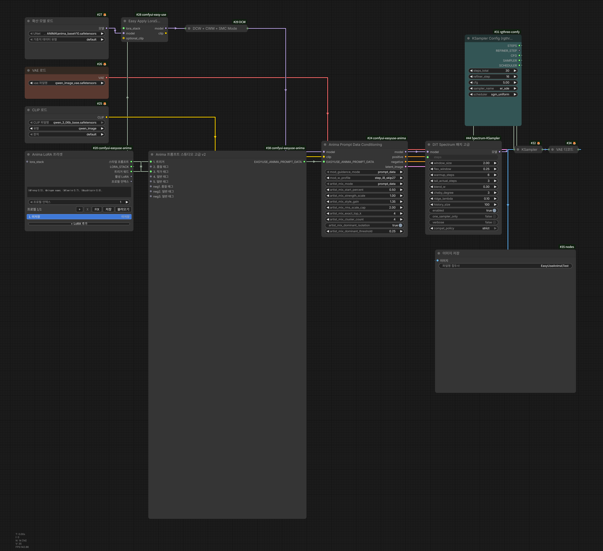

# Anima Artist Mix Conditioning

카테고리: `EasyUse Anima/Prompt`

입력:

- `clip`
- `prompt`
- `artist_tags`
- `artist_position`
- `artist_mix_mode`
- artist mix tuning inputs

출력:

- `positive`

일반 positive prompt와 별도 작가 태그 입력을 받아 positive `CONDITIONING`을
출력하는 단독 artist mix 노드입니다. Prompt Studio Advanced v2를 쓰지 않는
workflow에서도 같은 artist mix 기법을 사용할 수 있습니다.

여기서 작가 태그는 `@`가 붙은 토큰이 아니라 `artist_tags` 입력칸에 넣은
작가 태그 문자열을 의미합니다.

## 위치 처리

`artist_position`은 작가 태그를 prompt에 배치하는 방식을 정합니다.

| 값 | 동작 |
| --- | --- |
| `correct` | 기본값입니다. `prompt`와 `artist_tags`를 합친 뒤 ANIMA prompt ordering으로 교정합니다. |
| `front` | 작가 태그를 prompt 앞에 고정합니다. |
| `back` | 작가 태그를 prompt 뒤에 고정합니다. |

`correct`는 ANIMA 문법에 맞는 순서를 우선합니다. 특정 외부 conditioning 노드나
실험용 workflow에서 작가 태그 위치를 강제로 고정해야 할 때만 `front` 또는
`back`을 사용합니다.

## Artist Mix Mode

artist mix는 "작가 태그를 문자열로 이어 붙일 것인가"와 "작가별 CLIP
conditioning을 따로 계산해서 섞을 것인가"의 차이입니다. 비용 기준은 positive
conditioning branch 수입니다. branch가 많을수록 작가별 영향은 더 분리되지만,
sampler가 처리할 conditioning도 늘어납니다.

처음에는 `prompt` 또는 `average`로 시작하고, 여러 작가의 비중 차이가 중요하면
`hybrid`를 쓰는 것이 무난합니다. 작가 수가 적고 정확한 분리가 필요할 때만
`exact`를 사용합니다.

| 값 | 비용 기준 | 언제 쓰나 |
| --- | --- | --- |
| `prompt` | positive 1 branch | 작가 태그를 prompt 안에 넣고 한 번만 인코딩합니다. 기존 prompt 작성 방식과 가장 비슷하며 비교 기준으로 좋습니다. |
| `average` | positive 1 branch | 작가별 conditioning을 만든 뒤 평균으로 합칩니다. 비용은 낮게 유지하면서 prompt 문자열 순서보다 작가 입력칸의 비중을 더 명확히 쓰고 싶을 때 적합합니다. |
| `delta_rms` | positive 1 branch | base prompt와 작가 prompt의 차이를 스타일 delta로 보고 압축합니다. `average`보다 작가 스타일이 약하다고 느껴질 때 시도합니다. |
| `hybrid` | top K + 1 branch | weight가 큰 상위 작가는 `exact`처럼 분리하고 나머지는 하나의 압축 branch로 합칩니다. `exact`가 무겁지만 주요 작가는 살리고 싶을 때 기본 선택지입니다. |
| `clustered` | cluster_count 중심 branch | 비슷한 작가 delta를 여러 묶음으로 나눠 압축합니다. 작가 수가 많고 `average`는 뭉개지며 `exact`는 너무 무거울 때 사용합니다. |
| `exact` | 작가 수 N branch | 작가마다 별도 conditioning branch를 만듭니다. 가장 직접적이고 분리도가 높지만 작가 수만큼 비용이 증가합니다. |

호환 모드:

- `composite_exact`: exact branch와 전체 artist prompt branch를 함께 사용합니다.
- `late_exact`: base prompt를 먼저 쓰고, 지정한 sampling 비율 이후 exact branch를 추가합니다.
- `average_late_exact`: 앞부분은 average, 뒤쪽은 exact에 가깝게 작동합니다.
- `scheduled_average`: sampling 구간에 따라 average artist conditioning을 적용합니다.

이 호환 모드들은 기존 Prompt Data Conditioning artist mix 경로와 같은 동작을
공유합니다. 대부분의 workflow에서는 `prompt`, `average`, `hybrid`, `exact`
중에서 먼저 고르는 것이 이해하기 쉽습니다.

## 예시 Workflow

- Workflow JSON: [EasyUse_Anima_artist_mix_release_ko.json](../example_workflows/EasyUse_Anima_artist_mix_release_ko.json)
- Preview PNG: [EasyUse_Anima_artist_mix_release_ko.png](../example_workflows/EasyUse_Anima_artist_mix_release_ko.png)

이 예시는 `Anima Prompt Studio Advanced v2`의 artist field를
`EASYUSE_ANIMA_PROMPT_DATA`로 넘기고, `Anima Prompt Data Conditioning`에서
`artist_mix_mode`를 `exact`로 적용하는 구성입니다. 예시의 작가 태그 문자열은
`@`로 시작하는 항목을 포함하지만, artist mix에서 말하는 작가 태그 기준은
문자 접두사가 아니라 artist field 또는 `artist_tags` 입력칸입니다.

## 튜닝 입력

- `artist_mix_start_percent`: late/scheduled 계열 모드가 시작되는 sampling 비율입니다.
- `artist_mix_strength_scale`: exact 계열 branch 강도 배율입니다.
- `artist_mix_style_gain`: `delta_rms`, `hybrid`, `clustered` 압축 branch의 스타일 반영 강도입니다.
- `artist_mix_rms_scale_cap`: RMS 스타일 에너지 복원 최대 배율입니다.
- `artist_mix_exact_top_k`: `hybrid`에서 exact로 유지할 상위 작가 수입니다.
- `artist_mix_cluster_count`: `clustered`에서 사용할 압축 branch 수입니다.
- `artist_mix_dominant_isolation`: dominant 작가를 cluster에 넣지 않고 exact branch로 유지합니다.
- `artist_mix_dominant_threshold`: dominant 판정 기준입니다.

## Advanced v2와의 차이

`Anima Prompt Data Conditioning`은 `EASYUSE_ANIMA_PROMPT_DATA` 안의 artist field와
artist mix 설정을 읽습니다. `Anima Artist Mix Conditioning`은 Prompt Data 없이
`prompt`와 `artist_tags` 입력만으로 같은 conditioning 출력을 만드는 단독 노드입니다.
