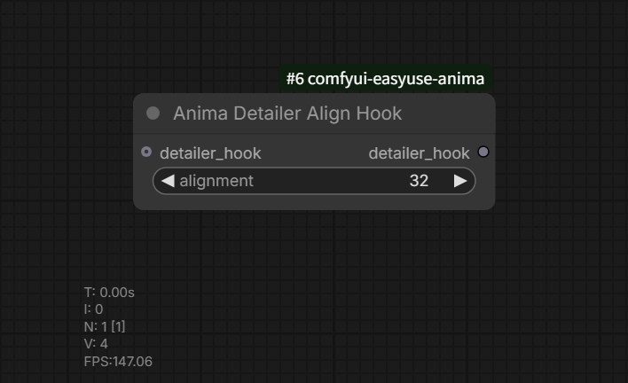

# Anima Detailer Align Hook

카테고리: `EasyUse Anima/Detailer`

출력:

- `detailer_hook`

Impact Pack과 호환되는 `DETAILER_HOOK`을 만들어 Impact detailer의 crop sampling
크기를 정렬합니다.

## 사용 위치

Impact `DetailerForEach` 또는 Impact 호환 SEGS detailer의 `detailer_hook` 입력에
연결합니다.

## 주요 동작

- `alignment=32`는 crop sampling width/height를 32배수로 올림 보정합니다.
- ANIMA/Spectrum workflow에서 16채널 VAE나 특수 VAE 경로가 32배수가 아닌 crop
  크기에서 실패하는 문제를 줄이기 위한 옵션입니다.
- 기존 `detailer_hook`을 연결하면 기존 hook 동작을 먼저 실행한 뒤 크기 정렬을
  적용합니다.
- `alignment=none`은 Impact Pack 원본 crop 크기를 유지합니다.
