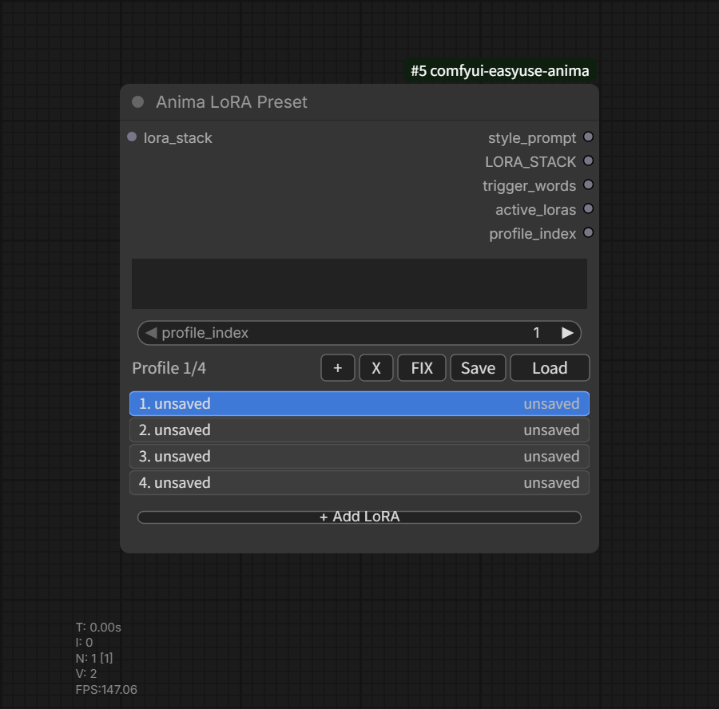

# Anima LoRA Preset

Category: `EasyUse Anima/LoRA`

Outputs:

- `style_prompt`
- `LORA_STACK`
- `trigger_words`
- `active_loras`
- `profile_index`

This node stores reusable LoRA/style profiles for ANIMA workflows.

## Main Behavior

- Multiple profiles can be stored in one node.
- `profile_index` can be controlled manually or through an input.
- Profiles keep style prompt text, selected LoRAs, LoRA strengths, and enabled
  state in the workflow.
- Profiles can be saved to and loaded from JSON files under the EasyUse Anima
  user data directory.
- Loading a saved profile appends it as a new profile instead of overwriting the
  current profile.

## LoRA UI

- `Add LoRA` opens a folder-tree chooser based on ComfyUI LoRA paths.
- The chooser supports search.
- Each row supports enable/disable, strength adjustment, move up, move down, and
  remove.
- The `i` preview button looks for same-name preview images near the LoRA file.
- ComfyUI Settings can show row labels as file names only or full relative paths.

## Trigger Words

When LoRA Manager-style metadata JSON sidecars are available, trigger words are
read, deduplicated, and output as a comma-separated string.

- Click `T+` / `T−` on a LoRA row, or use `Use trigger words` in its context
  menu, to enable or disable that LoRA's trigger words.
- Disabling triggers preserves LoRA weights and strengths. Disabling the LoRA
  excludes its triggers too. The setting is saved with profiles and workflows;
  older profiles default to enabled.
