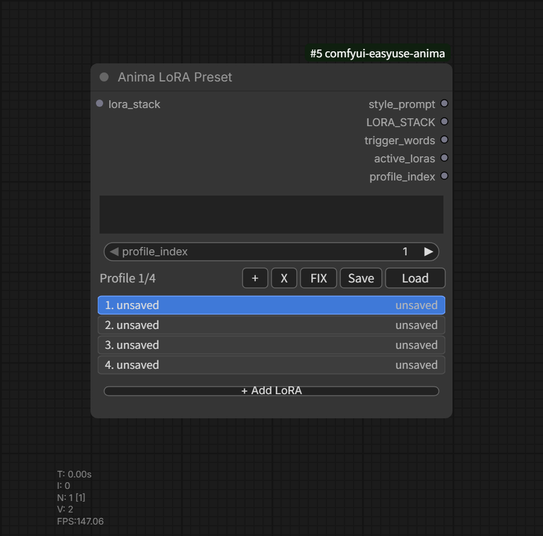

# Anima LoRA Preset

카테고리: `EasyUse Anima/LoRA`

출력:

- `style_prompt`
- `LORA_STACK`
- `trigger_words`
- `active_loras`
- `profile_index`

ANIMA workflow에서 재사용할 LoRA/style profile을 저장하는 노드입니다.

## 주요 동작

- 한 노드 안에 여러 profile을 저장할 수 있습니다.
- `profile_index`는 수동 또는 input으로 제어할 수 있습니다.
- profile은 style prompt, 선택한 LoRA, LoRA strength, 활성화 상태를 workflow에
  저장합니다.
- profile은 EasyUse Anima 사용자 데이터 디렉토리 아래 JSON 파일로 저장하고
  불러올 수 있습니다.
- 저장된 profile을 불러오면 현재 profile을 덮어쓰지 않고 새 profile로
  추가합니다.

## LoRA UI

- `Add LoRA`는 ComfyUI LoRA 경로 기반 folder-tree chooser를 엽니다.
- chooser에서 검색할 수 있습니다.
- 각 row는 enable/disable, strength 조절, move up, move down, remove를
  지원합니다.
- `i` preview button은 LoRA 파일 근처의 같은 이름 preview image를 찾습니다.
- ComfyUI Settings에서 row label을 파일명만 표시하거나 전체 상대 경로로
  표시할 수 있습니다.

## Trigger Words

LoRA Manager 방식 metadata JSON sidecar가 있으면 trigger word를 읽고, 중복 제거
후 쉼표로 구분된 문자열로 출력합니다.
