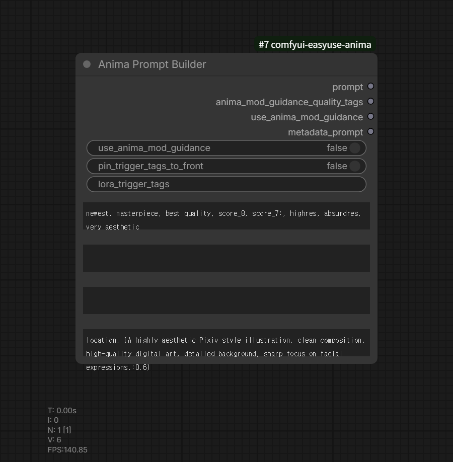

# Anima Prompt Builder

Category: `EasyUse Anima/Prompt`

Outputs:

- `prompt`
- `anima_mod_guidance_quality_tags`
- `use_anima_mod_guidance`
- `metadata_prompt`

This node assembles a cleaned prompt from separate fields for NAIA and Anima Mod
Guidance workflows.

## Input Fields

- `lora_trigger_tags`: one-line trigger tags from a LoRA manager.
- `quality_tags`: leading quality tags.
- `trigger_and_artist_tags`: manual model triggers and `@artist` tags.
- `prompt`: main prompt body.
- `trailing_quality_tags`: trailing quality or style tags.

## Behavior

- Line breaks are treated as comma separators.
- Empty comma groups and duplicate whitespace are cleaned.
- Combined prompt text is passed through ANIMA prompt ordering.
- `use_anima_mod_guidance=true` excludes quality fields from `prompt` and returns
  them through `anima_mod_guidance_quality_tags`.
- `metadata_prompt` includes quality fields regardless of AMG mode.
- `pin_trigger_tags_to_front=true` fixes trigger fields before quality tags.
