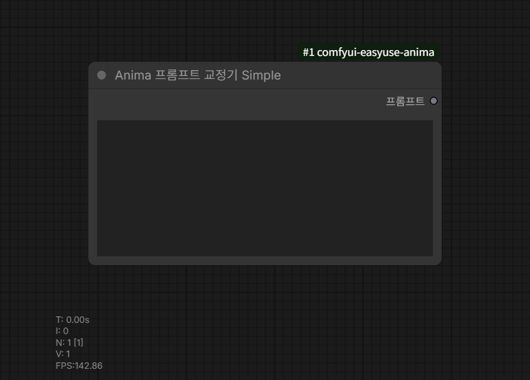

# Anima Prompt Corrector

Category: `EasyUse Anima/Prompt`

Outputs:

- `corrected_prompt`
- `report`

This node accepts a comma-separated prompt and returns an ANIMA-ordered prompt
plus a JSON report.

## Simple Version

`Anima Prompt Corrector Simple` is the compact variant for regular multiline
string workflows.

Input:

- `prompt`

Output:

- `prompt`

It uses the same correction rules as `Anima Prompt Corrector`, but it does not
expose `artist_overrides`, `artist_exclusions`, or the JSON `report`. Use the
Simple version when only the corrected prompt string needs to be passed onward;
use the full corrector when unknown or duplicate tag reporting is needed.

## Main Inputs

- `prompt`: source prompt to normalize.
- `artist_overrides`: manual comma- or newline-separated artist triggers.
- `artist_exclusions`: tags that must not be treated as artists.

## Prompt Handling

- Unescaped parentheses are treated as prompt weighting syntax and preserved.
- Literal parentheses in tag names should be escaped as `\(` and `\)`.
- Commas inside weighted parentheses are not split as top-level separators.
- Natural-language text keeps its original casing.
- Count tags such as `1girl` immediately after a natural-language sentence are
  split out and reordered normally.
