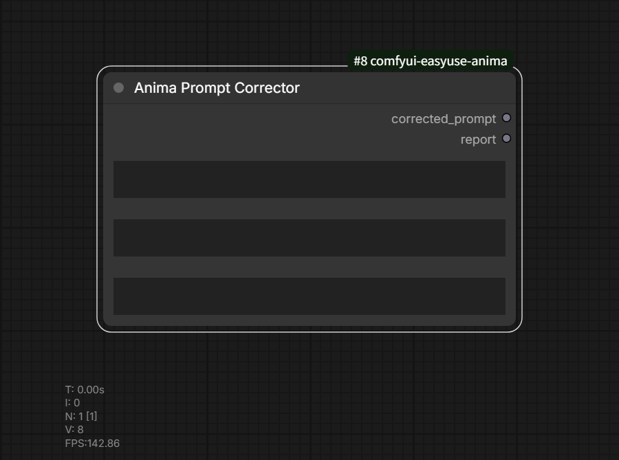

# Anima Prompt Corrector

카테고리: `EasyUse Anima/Prompt`

출력:

- `corrected_prompt`
- `report`

쉼표로 구분된 프롬프트를 받아 ANIMA 순서로 정규화된 프롬프트와 JSON report를
반환합니다.

## 주요 입력

- `prompt`: 정리할 원본 프롬프트입니다.
- `artist_overrides`: 쉼표 또는 줄바꿈으로 구분한 수동 작가 trigger입니다.
- `artist_exclusions`: 작가로 취급하지 않을 태그입니다.

## 프롬프트 처리

- escape되지 않은 괄호는 가중치 문법으로 취급하고 보존합니다.
- 태그 이름에 들어가는 literal 괄호는 `\(`, `\)`로 escape합니다.
- 가중치 괄호 내부의 쉼표는 최상위 태그 구분자로 나누지 않습니다.
- 자연어 프롬프트는 기존 대소문자를 유지합니다.
- 자연어 문장 바로 뒤의 `1girl` 같은 인원수 태그는 분리해 재정렬합니다.
