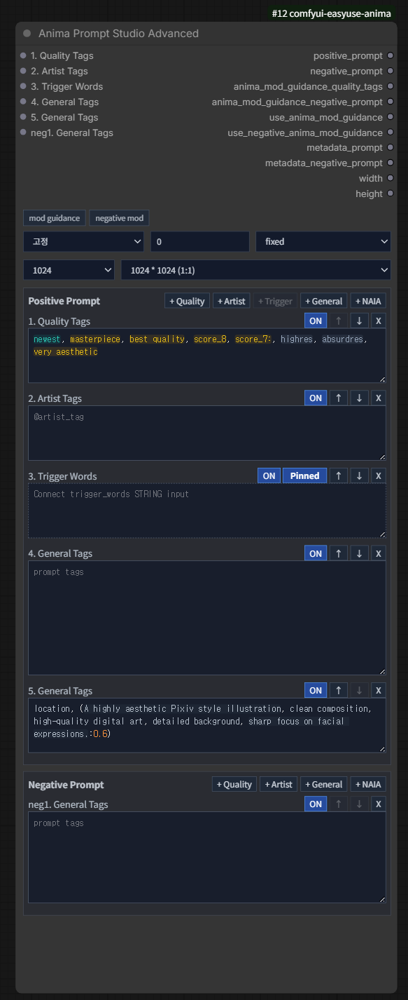

# Anima Prompt Studio Advanced

Category: `EasyUse Anima/Prompt`

Outputs:

- `positive_prompt`
- `negative_prompt`
- `anima_mod_guidance_quality_tags`
- `use_anima_mod_guidance`
- `metadata_prompt`
- `metadata_negative_prompt`
- `width`
- `height`

This is the flexible Prompt Studio variant for larger workflows.

## Field Model

- Positive and negative prompts are edited as separate field groups.
- Fields can be added, removed, reordered, enabled, or disabled.
- Positive field types are quality, artist, trigger, general, and NAIA.
- Negative prompts can also contain one NAIA field.
- The NAIA field stores the last NAIA result in the workflow and remains editable
  after it is filled.
- The trigger field can display connected `trigger_words` and can be pinned to
  the front or passed through ANIMA ordering.

## Resolution

- Latent image resolution controls are shown below `mod guidance`.
- Buckets support `512`, `768`, `896`, `1024`, `1280`, and `1536`.
- `Custom` stores editable width and height values in the workflow.
- `NAIA` uses width and height from the same NAIA response that fills prompt
  fields.
- Saved-image workflows store the resolved size as `Custom` so the result can be
  reproduced.

## Wildcards

The wildcard control row below `mod guidance` sets mode, seed, and seed after
generate.

- The live workflow keeps original wildcard text and the next seed state.
- Saved-image workflows store expanded text in `재현` mode.
- When NAIA fill is also enabled, NAIA text is applied before wildcard expansion.

See the [Wildcard Guide](../wildcards.en.md) for syntax.

## Highlighting

- Quality, safety/rating, year, count, character, artist, copyright, metadata,
  learned general tags, natural language, syntax errors, and unknown tags use
  separate highlight classes.
- Wildcard syntax such as `__wildcard__`, `3#__wildcard__`, and `{a|b|c}` uses a
  separate wildcard color.
- Highlight overlays synchronize font family, size, spacing, and wrapping with
  the source input.
