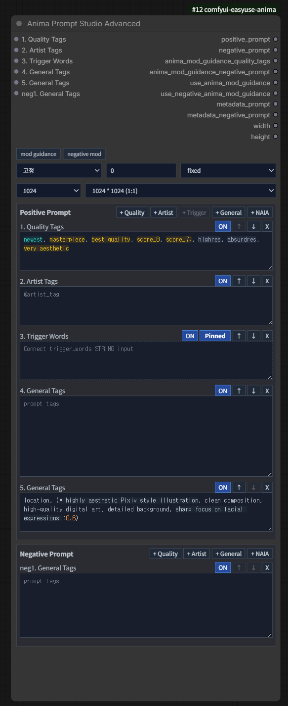

# Anima Prompt Studio Advanced

카테고리: `EasyUse Anima/Prompt`

출력:

- `positive_prompt`
- `negative_prompt`
- `anima_mod_guidance_quality_tags`
- `anima_mod_guidance_negative_prompt`
- `use_anima_mod_guidance`
- `use_negative_anima_mod_guidance`
- `metadata_prompt`
- `metadata_negative_prompt`
- `width`
- `height`

큰 workflow를 위한 확장형 Prompt Studio 노드입니다.

## 필드 구조

- positive prompt와 negative prompt를 별도 field group으로 편집합니다.
- field는 추가, 삭제, 순서 변경, 활성화, 비활성화할 수 있습니다.
- positive field type은 quality, artist, trigger, general, NAIA를 지원합니다.
- negative prompt에도 NAIA field를 1개 추가할 수 있습니다.
- NAIA field는 마지막 NAIA 결과를 workflow에 저장하며, 채워진 뒤에도 직접
  수정할 수 있습니다.
- trigger field는 연결된 `trigger_words` 입력을 표시할 수 있고, front 고정
  또는 ANIMA ordering 적용을 선택할 수 있습니다.

## 해상도

- latent image 해상도는 `해상도 버킷` 버튼으로 설정합니다.
- 노드에는 현재 bucket과 실제 해상도 요약만 표시되고, 상세 선택은 팝업에서
  관리합니다.
- bucket은 `512`, `768`, `896`, `1024`, `1280`, `1536`을 지원합니다.
- `Custom` bucket에서는 width와 height를 직접 입력하고 workflow에 저장합니다.
- `NAIA` bucket은 prompt field를 채우는 것과 같은 NAIA 응답에서 width와
  height를 가져옵니다.
- 저장 이미지 workflow에는 해결된 해상도를 `Custom`으로 저장해 같은 결과를
  다시 만들 수 있게 합니다.

## 와일드카드

`와일드카드 시드` 버튼에서 mode, seed, seed after generate를 설정합니다.
노드에는 현재 와일드카드 모드, seed, seed control 요약만 표시됩니다.

- live workflow는 원본 와일드카드 텍스트와 다음 seed 상태를 유지합니다.
- 저장 이미지 workflow는 확장 결과를 `재현` mode로 저장합니다.
- NAIA 채우기와 같이 사용할 때는 NAIA 결과를 먼저 받은 뒤 와일드카드를
  확장합니다.

문법은 [와일드카드 가이드](../wildcards.ko.md)를 참고하세요.

## Artist Mix

`Anima Prompt Studio Advanced v2`는 기존 문자열 출력 대신
`EASYUSE_ANIMA_PROMPT_DATA` 하나를 출력합니다. 이 prompt data 안에는 artist
field 텍스트와 `artist_mix` 설정이 별도 key로 저장됩니다.

Prompt data에는 기존 호환 출력값을 담은 `outputs`와 v2 노드의 required 입력값을
키로 저장한 `parameters`가 함께 들어갑니다. downstream 노드는 새 항목이 추가되어도
출력 순서가 아니라 dict key로 값을 읽어야 합니다.

- artist field는 `@`가 붙은 토큰을 찾는 방식이 아니라 Advanced의 작가 태그
  입력 field를 의미합니다.
- artist mix를 끄면 artist field 텍스트는 기존처럼 positive prompt에 포함됩니다.
- artist mix를 켜면 base prompt에서는 artist field 텍스트를 분리하고,
  `Anima Prompt Data Conditioning`이 선택한 artist mix mode로 positive
  `CONDITIONING`을 만듭니다.
- Artist Mix와 Mod Guidance 조정은 노드 본문을 늘리지 않고 팝업에서 관리합니다.
  Artist Mix 팝업의 각 항목에는 `i` 도움말 버튼이 있어 해당 파라미터가 어떤
  branch나 weight에 영향을 주는지 확인할 수 있습니다.
- 여러 작가를 하나의 mix branch로 유지하려면 `[[artist_a, artist_b:0.7]]`
  문법을 사용합니다. `]]` 직전의 마지막 `:0.7`은 prompt 문자열 가중치가 아니라
  conditioning mix weight로만 사용됩니다. Artist Mix를 끄거나 `prompt` 모드로
  쓰면 그룹 기호와 그룹 weight는 제거되고 일반 작가 태그로 펼쳐집니다.
- 그룹 안에서 개별 prompt weight가 필요하면 `(artist_a:0.35)`처럼 일반
  프롬프트 가중치 문법을 사용합니다. Artist Mix 그룹 weight는 괄호 밖 최상위
  마지막 `:weight`만 의미합니다.
- Prompt Data 없이 일반 prompt와 작가 태그만 처리하려면
  [Anima Artist Mix Conditioning](anima-artist-mix-conditioning.ko.md)을 사용합니다.

## Prompt Data Helper Nodes

- `Anima Prompt Studio Advanced v2`: `EASYUSE_ANIMA_PROMPT_DATA` 하나를 출력합니다.
- `EASYUSE_ANIMA_PROMPT_DATA`: prompt data를 context처럼 통과시키고, 선택 입력으로
  기존 호환 출력값을 덮어쓴 뒤 문자열, boolean, width, height 출력으로 펼칩니다.
- `Anima Prompt Data Conditioning`: prompt data를 읽어 positive/negative
  `CONDITIONING`, batch size 1 `latent_image`, Spectrum Mod Guidance 적용 모델을
  출력합니다.

## 자동완성

- 자동완성은 실제 태그 텍스트 위에 커서가 있을 때만 후보를 표시합니다.
- 괄호, 쉼표, `[[`, `]]` 같은 문법 문자만 선택된 위치에서는 불필요한 후보를
  열지 않습니다.
- 자동완성 인라인 미리보기를 켜면 선택 후보를 적용했을 때 들어갈 나머지
  텍스트가 입력칸의 하이라이트 overlay에 ghost text로 표시됩니다.
- 자동완성은 `(tag:1.2)`의 괄호와 가중치, `[[...]]` 그룹 문법을 보존한 채
  내부 태그만 치환합니다.

## 하이라이트

- quality, safety/rating, year, count, character, artist, copyright, metadata,
  learned general tag, natural language, syntax error, unknown tag를 구분해
  표시합니다.
- `__wildcard__`, `3#__wildcard__`, `{a|b|c}` 같은 와일드카드 문법은 일반
  태그와 별도 색상으로 표시합니다.
- `(tag:1.2)`, `[[artist_a, artist_b:0.7]]` 같은 가중치 문법은 EasyUse Anima
  PromptStudio 하이라이트 설정에서 밑줄 표시를 켤 수 있습니다.
- `(@artist name)` 또는 `(highres, long hair)`처럼 가중치 없이 괄호로 감싼
  태그도 내부 태그 기준으로 분류하고 색상을 표시합니다.
- overlay는 입력칸의 font family, size, spacing, wrapping 설정을 따라가도록
  동기화됩니다.
