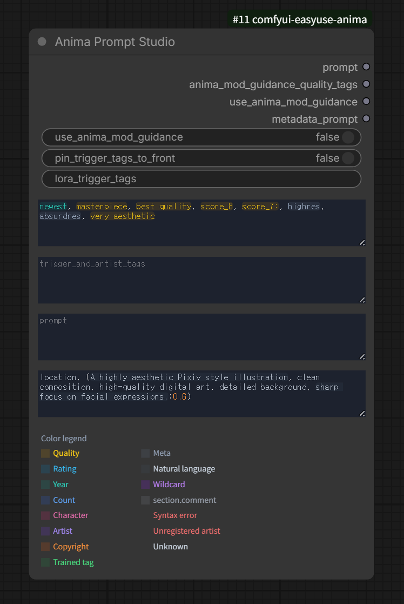

# Anima Prompt Studio

카테고리: `EasyUse Anima/Prompt`

`Anima Prompt Builder`와 같은 출력 및 프롬프트 조합 동작을 사용하지만, 노드 UI
안에서 편집하기 위한 기능을 추가한 버전입니다.

## 주요 기능

- LoRA trigger 입력칸을 노드 상단에 배치합니다.
- 프롬프트 입력칸 높이를 노드 안에서 조절할 수 있습니다.
- 텍스트 입력칸에 태그 자동완성과 카테고리별 하이라이트가 적용됩니다.
- 외부 연결로 받은 텍스트도 workflow 실행 후 preview와 하이라이트에 반영합니다.
- 입력한 텍스트는 workflow 저장에 포함됩니다.

## 관련 문서

- [자동완성 CSV 가이드](../autocomplete-csv.ko.md)
- [와일드카드 문법](../wildcards.ko.md)
