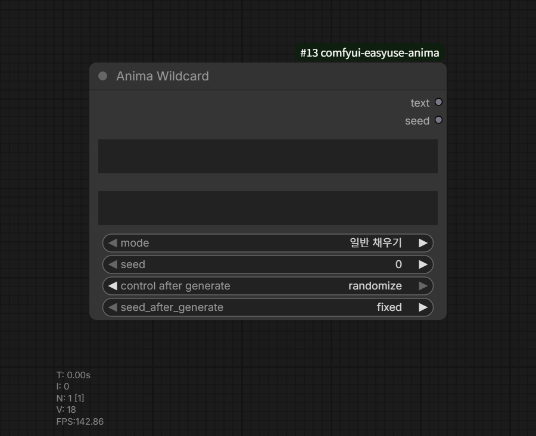

# Anima Wildcard

Category: `EasyUse Anima/Prompt`

Outputs:

- `text`
- `seed`

This node expands wildcard text without using Prompt Studio.



## Default Location

Loading the node pack creates the default folder and a test file.

```text
ComfyUI/user/__easyuse_anima/wildcards/easyuse_anima_test.txt
```

Existing user wildcard folders can be registered in ComfyUI Settings under the
EasyUse Anima `Wildcard` section.

## Syntax

Common syntax:

```text
__hair_color__
__*/hair_color__
__style/*__
3#__hair_color__
{red|blue|green}
{2::red|5::blue|green}
{2$$red|blue|green}
{1-3$$, $$red|blue|green}
```

For the full syntax and examples, see the [Wildcard Guide](../wildcards.en.md).

## Modes

- `일반 채우기`: expands the source text with seed-based selection.
- `고정`: produces the same result for the same source, seed, and files.
- `순차`: selects `seed % candidate_count` from each candidate list.
- `재현`: reuses expanded text stored in saved-image workflows.

The `seed` output is the next seed after applying seed after generate.
