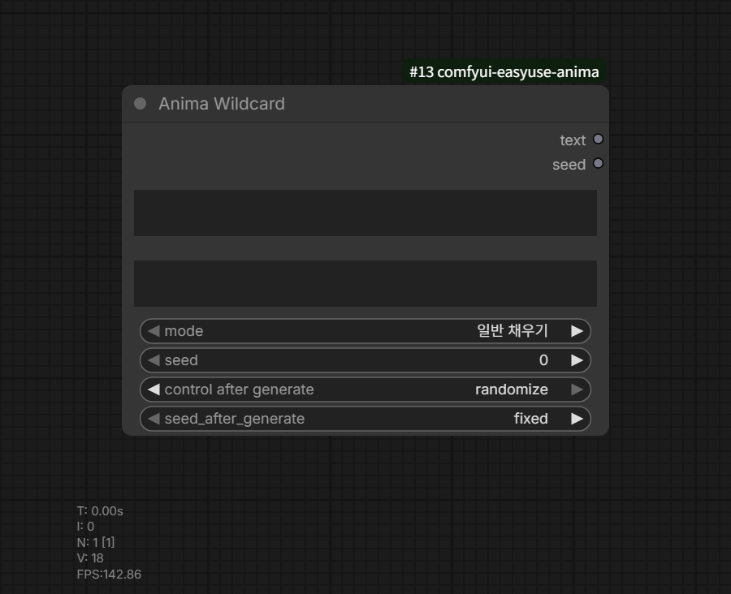

# Anima Wildcard

카테고리: `EasyUse Anima/Prompt`

출력:

- `text`
- `seed`

Prompt Studio 없이 와일드카드 문자열만 확장하는 노드입니다.



## 기본 위치

노드팩을 로드하면 기본 폴더와 테스트 파일을 만듭니다.

```text
ComfyUI/user/__easyuse_anima/wildcards/easyuse_anima_test.txt
```

ComfyUI Settings의 EasyUse Anima `Wildcard` 섹션에서 기존 사용자 와일드카드
폴더를 추가 경로로 등록할 수 있습니다.

순환 참조나 과도한 확장이 있는 YAML 파일은 개별적으로 건너뜁니다. 파일별 한도는
깊이 64, 순회 65,536회, 부모 별칭을 포함한 옵션 참조 65,536개,
누적 출력 8,388,608자입니다. 큰 라이브러리는 작은 파일로 나누세요.
정상적인 중복 옵션의 선택 가중치는 유지합니다.

## 문법

자주 쓰는 문법:

```text
__hair_color__
__*/hair_color__
__style/*__
3#__hair_color__
{red|blue|green}
{2::red|5::blue|green}
{2$$red|blue|green}
{1-3$$, $$red|blue|green}
```

전체 문법과 예시는 [와일드카드 가이드](../wildcards.ko.md)를 참고하세요.

## 모드

- `일반 채우기`: 원본 텍스트를 seed 기반으로 확장합니다.
- `고정`: 같은 원문, seed, 파일 상태에서 같은 결과를 만듭니다.
- `순차`: 각 후보 목록에서 `seed % candidate_count` index를 선택합니다.
- `재현`: 저장 이미지 workflow에 기록된 확장 결과를 재사용합니다.

`seed` 출력은 seed after generate를 적용한 다음 seed입니다.
